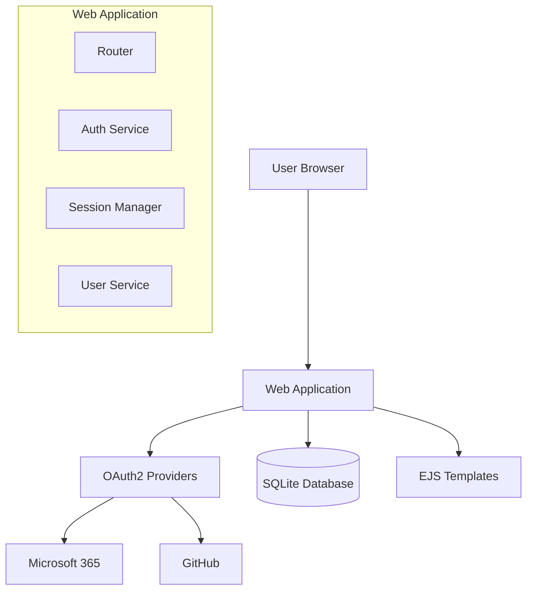
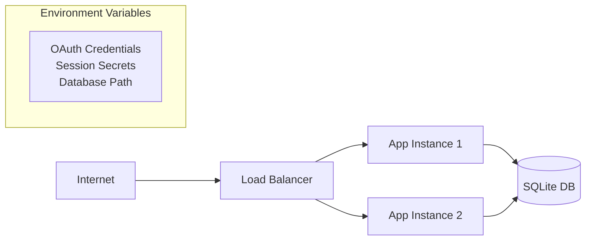

# Design Document

## Overview

The SSO Web Application is a TypeScript-based web service that provides secure authentication through Microsoft 365 and GitHub OAuth2 providers. The application follows a traditional server-side rendered architecture using EJS templates, with SQLite for data persistence and session-based authentication.

## Architecture

### High-Level Architecture



### Technology Stack

- **Runtime**: Node.js with TypeScript
- **Web Framework**: Express.js (recommended for OAuth2 integration and middleware support)
- **Templating**: EJS (Embedded JavaScript Templates)
- **Database**: SQLite with better-sqlite3 driver
- **Authentication**: OAuth2 with passport.js strategy
- **Session Management**: express-session with SQLite store

**Note**: EJS provides excellent TypeScript integration and is perfect for server-side rendering with the flexibility to embed JavaScript logic directly in templates, making it ideal for our simple SSO application.

## Components and Interfaces

### 1. Authentication Service

```typescript
interface AuthService {
  initializeOAuth(): void;
  handleMicrosoftCallback(code: string): Promise<UserProfile>;
  handleGitHubCallback(code: string): Promise<UserProfile>;
  createSession(userId: string): Promise<string>;
  validateSession(sessionId: string): Promise<User | null>;
  destroySession(sessionId: string): Promise<void>;
}

interface UserProfile {
  id: string;
  username: string;
  email: string;
  provider: 'microsoft' | 'github';
}
```

### 2. User Service

```typescript
interface UserService {
  findByProviderId(providerId: string, provider: string): Promise<User | null>;
  createUser(profile: UserProfile): Promise<User>;
  updateUser(userId: string, profile: Partial<UserProfile>): Promise<User>;
}

interface User {
  id: string;
  username: string;
  email: string;
  provider: string;
  providerId: string;
  createdAt: Date;
  updatedAt: Date;
}
```

### 3. Session Manager

```typescript
interface SessionManager {
  create(userId: string): Promise<Session>;
  validate(sessionId: string): Promise<Session | null>;
  destroy(sessionId: string): Promise<void>;
  cleanup(): Promise<void>; // Remove expired sessions
}

interface Session {
  id: string;
  userId: string;
  createdAt: Date;
  expiresAt: Date;
}
```

### 4. Route Handlers

```typescript
interface RouteHandlers {
  renderLogin(req: Request, res: Response): void;
  renderDashboard(req: Request, res: Response): void;
  handleMicrosoftAuth(req: Request, res: Response): void;
  handleGitHubAuth(req: Request, res: Response): void;
  handleLogout(req: Request, res: Response): void;
}
```

## Data Models

### Database Schema

```sql
-- Users table
CREATE TABLE users (
    id TEXT PRIMARY KEY,
    username TEXT NOT NULL,
    email TEXT NOT NULL,
    provider TEXT NOT NULL,
    provider_id TEXT NOT NULL,
    created_at DATETIME DEFAULT CURRENT_TIMESTAMP,
    updated_at DATETIME DEFAULT CURRENT_TIMESTAMP,
    UNIQUE(provider, provider_id)
);

-- Sessions table
CREATE TABLE sessions (
    id TEXT PRIMARY KEY,
    user_id TEXT NOT NULL,
    created_at DATETIME DEFAULT CURRENT_TIMESTAMP,
    expires_at DATETIME NOT NULL,
    FOREIGN KEY (user_id) REFERENCES users (id) ON DELETE CASCADE
);

-- Indexes for performance
CREATE INDEX idx_sessions_user_id ON sessions(user_id);
CREATE INDEX idx_sessions_expires_at ON sessions(expires_at);
CREATE INDEX idx_users_provider ON users(provider, provider_id);
```

### OAuth2 Configuration

```typescript
interface OAuthConfig {
  microsoft: {
    clientId: string;
    clientSecret: string;
    redirectUri: string;
    scope: string[];
  };
  github: {
    clientId: string;
    clientSecret: string;
    redirectUri: string;
    scope: string[];
  };
}
```

## Error Handling

### Error Types

```typescript
enum ErrorType {
  AUTHENTICATION_FAILED = 'AUTHENTICATION_FAILED',
  SESSION_EXPIRED = 'SESSION_EXPIRED',
  USER_NOT_FOUND = 'USER_NOT_FOUND',
  DATABASE_ERROR = 'DATABASE_ERROR',
  OAUTH_ERROR = 'OAUTH_ERROR',
  TEMPLATE_ERROR = 'TEMPLATE_ERROR'
}

interface AppError {
  type: ErrorType;
  message: string;
  statusCode: number;
  details?: any;
}
```

### Error Handling Strategy

1. **OAuth Errors**: Redirect to login page with error message
2. **Session Errors**: Clear invalid sessions and redirect to login
3. **Database Errors**: Log error and show generic error page
4. **Template Errors**: Log error and fallback to basic HTML response
5. **Validation Errors**: Return to form with validation messages

### Middleware Stack

```typescript
app.use(helmet()); // Security headers
app.use(express.json());
app.use(express.urlencoded({ extended: true }));
app.use(session({
  store: new SQLiteStore(),
  secret: process.env.SESSION_SECRET,
  resave: false,
  saveUninitialized: false,
  cookie: {
    secure: process.env.NODE_ENV === 'production',
    httpOnly: true,
    maxAge: 24 * 60 * 60 * 1000 // 24 hours
  }
}));
app.use(passport.initialize());
app.use(passport.session());
```

## Testing Strategy

### Unit Tests

1. **Authentication Service Tests**
   - OAuth2 token exchange
   - Session creation and validation
   - User profile extraction

2. **User Service Tests**
   - User creation and retrieval
   - Database operations
   - Data validation

3. **Route Handler Tests**
   - Request/response handling
   - Authentication middleware
   - Template rendering

### Integration Tests

1. **OAuth2 Flow Tests**
   - End-to-end authentication flow
   - Provider callback handling
   - Session management

2. **Database Integration Tests**
   - Schema creation and migration
   - CRUD operations
   - Session storage

### End-to-End Tests

1. **User Journey Tests**
   - Complete login flow with both providers
   - Dashboard access and logout
   - Session persistence across requests

### Security Considerations

1. **OAuth2 Security**
   - PKCE (Proof Key for Code Exchange) for public clients
   - State parameter validation to prevent CSRF
   - Secure token storage

2. **Session Security**
   - HTTP-only cookies
   - Secure flag in production
   - Session rotation on login

3. **Database Security**
   - Prepared statements to prevent SQL injection
   - Input validation and sanitization
   - Secure credential storage

### Performance Considerations

1. **Database Optimization**
   - Connection pooling
   - Proper indexing
   - Session cleanup job

2. **Template Caching**
   - Compile templates at startup
   - Cache compiled templates in memory

3. **Static Asset Handling**
   - Serve static files efficiently
   - Enable compression

### Deployment Architecture



### Configuration Management

```typescript
interface AppConfig {
  port: number;
  nodeEnv: 'development' | 'production' | 'test';
  databasePath: string;
  sessionSecret: string;
  oauth: OAuthConfig;
  baseUrl: string;
}
```